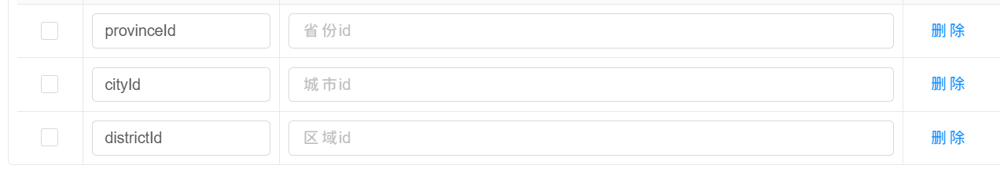

# Lease

## 项目简介

`lease` 是一个面向长租公寓场景的后端项目，覆盖公寓、房间、租约、看房预约、用户和系统管理等业务域。

当前仓库整体处于骨架阶段：
- 多模块结构已完成
- 实体与枚举已定义
- Controller 路由已定义
- Mapper 接口与 XML 已生成
- API 文档分组已配置

大部分业务逻辑仍待实现。

## 技术栈

- Java 17
- Spring Boot 3.0.5
- Spring Web
- MyBatis-Plus 3.5.3.1
- MySQL + HikariCP
- OpenAPI 3 + Knife4j
- Lombok

## 模块结构

```text
lease
|-- common                # 公共模块（统一返回结构 + MyBatis-Plus 配置）
|-- model                 # 领域模型（entity + enum）
`-- web                   # Web 聚合模块
    |-- web-admin         # 后台管理端（当前可运行入口）
    `-- web-app           # 面向客户端的预留模块（当前基本为空）
```

## 主要接口域（已定义路由）

- 登录与用户信息：`/admin/login/**`、`/admin/info`
- 系统管理：`/admin/system/**`
- 公寓管理：`/admin/apartment/**`
- 房间管理：`/admin/room/**`
- 基础字典：`/admin/label/**`、`/admin/facility/**`、`/admin/fee/**`、`/admin/attr/**`、`/admin/payment/**`、`/admin/region/**`、`/admin/term/**`
- 租赁管理：`/admin/agreement/**`、`/admin/appointment/**`
- 平台用户管理：`/admin/user/**`
- 文件上传：`/admin/file/**`

## 当前实现状态

- `web-admin` 中大多数 Controller 仍返回占位结果（`Result.ok()`）。
- `service` 层目前主要是接口定义，尚未提供 `ServiceImpl` 实现。
- 多数 Mapper XML 还是空模板。
- 仓库内暂无数据库初始化 SQL 或迁移脚本。
- 测试代码目前较少或为空。

## 环境要求

- JDK 17
- Maven 3.8+
- MySQL 8.x（或兼容版本）

## 快速开始

1. 配置数据源  
   修改 `web/web-admin/src/main/resources/application.yml` 中：
   - `spring.datasource.url`
   - `spring.datasource.username`
   - `spring.datasource.password`

2. 构建项目

```bash
mvn clean package -DskipTests
```

3. 启动后台服务

```bash
mvn -pl web/web-admin -am spring-boot:run
```

4. 访问地址

- 服务地址：`http://localhost:8080`
- Knife4j 文档：`http://localhost:8080/doc.html`
- OpenAPI JSON：`http://localhost:8080/v3/api-docs`

## 统一返回结构

`common` 模块提供 `Result<T>` 作为统一响应封装：

```json
{
  "code": 200,
  "message": "成功",
  "data": {}
}
```

## 后续建议

1. 补全 `service` 与 `mapper` 层业务逻辑。
2. 增加数据库建表脚本或引入迁移工具（Flyway/Liquibase）。
3. 增加认证鉴权与全局异常处理。
4. 增加集成测试与接口测试。

## MyBatis-Plus Service 调用链说明

### 问题：为什么 Controller 里可以直接调 `service.saveOrUpdate()`？

明明你在 `PaymentTypeService` 和 `PaymentTypeServiceImpl` 里一行代码都没写，却可以直接用 `saveOrUpdate()`、`list()`、`getById()` 这些方法？

### 答案：因为这些方法是从"父辈"继承来的

打个比方：你爸会开车，你继承了你爸，那你也会开车，不需要自己再学一遍。

在代码里也是一样的：

```
你写的 PaymentTypeService  ──继承了──>  IService（MyBatis-Plus 提供的，里面有几十个现成方法）
你写的 PaymentTypeServiceImpl  ──继承了──>  ServiceImpl（MyBatis-Plus 提供的，里面写好了所有方法的具体实现）
```

所以虽然你什么都没写，但通过继承，你的 Service 已经自带了 `saveOrUpdate()`、`list()`、`getById()` 等方法。

### 具体看代码

**第1步：你的 Service 接口继承了 IService**
```java
// PaymentTypeService.java
public interface PaymentTypeService extends IService<PaymentType> {
    // 虽然这里是空的，但因为继承了 IService，所以已经拥有了 saveOrUpdate()、list() 等方法的"声明"
}
```

**第2步：你的实现类继承了 ServiceImpl**
```java
// PaymentTypeServiceImpl.java
public class PaymentTypeServiceImpl extends ServiceImpl<PaymentTypeMapper, PaymentType>
    implements PaymentTypeService {
    // 虽然这里也是空的，但因为继承了 ServiceImpl，所以 saveOrUpdate()、list() 等方法已经有了"具体实现"
}
```

**第3步：Controller 直接调用**
```java
// PaymentTypeController.java
service.saveOrUpdate(paymentType);  // 直接就能用，因为上面两步已经把方法准备好了
```

### 总结

> **你不用自己写 `saveOrUpdate()` 的代码，因为 MyBatis-Plus 已经帮你写好了，你只需要通过 `extends`（继承）就能直接用。**


## 问题：是谁调用了这些 Controller 里的方法？

你可能发现，我们在代码里只写了 `public Result<List<LeaseTerm>> listLeaseTerm()`，但是从来没有在哪行代码里去 `new Controller()` 然后调这个方法。那它是怎么运行起来的？

### 答案：是 Spring 框架"大管家"自动帮你调用的！

简单来说，**下达命令的是前端（浏览器/手机），而真正在后台帮你执行调用的，是 Spring 框架。**

### 形象比喻（饭店点菜模型）

- **前端（浏览器/手机/小程序）** = **顾客**。
  - 顾客打开系统，点了一下"租期管理"菜单。
  - 浏览器立刻向后台发送一个 HTTP 请求（就像给后台打了个电话）："喂！给我来一份 `GET /admin/term/list` 对应的数据！"
- **Spring 框架（DispatcherServlet）** = **大堂经理/服务员**。
  - 服务员一直在门口等着（监听 8080 端口），听到了顾客点菜。
  - 服务员查了一下菜单（扫描你写的代码），发现：哎！`LeaseTermController` 里有个方法头上刚好贴着 `@GetMapping("list")` 这个标签。
- **Controller 方法（你写的代码）** = **后厨厨师张三**。
  - 服务员跑到后厨大喊："张三，赶紧执行你的 `listLeaseTerm()` 方法！"
  - 于是 Spring **自动帮你把这个方法运行起来了**。
  - 你在方法里查好数据，装盘（`return Result.ok(list)`）交给服务员。
  - 最后服务员把这盘数据端给顾客（前端在表格里渲染展示出来）。

你写的在 Controller 里的方法，就像是饭店大厨准备好的一道道菜。你只负责把菜谱（地址注解如 `@GetMapping`）贴在菜单上，只要前端一发请求（点菜），Spring 这个自带的服务员就会自动跑去后厨触发你的方法。**你永远不需要在代码里自己去调它。**

## 数据流转与类型转换说明

### 问题：为什么 `LabelController` 中的 `type` 字段会涉及到多次类型转换？

以 `LabelController#labelList(@RequestParam(required = false) ItemType type)` 为例，前端通常传 `type=1`，Controller 收到的是 `ItemType.APARTMENT`，SQL 又会变成 `where type = 1`。这不是重复劳动，而是每一层都在使用自己最合适的数据表示。

### 答案：因为前端、后端、数据库“讲的是三种不同的语言”，需要“翻译官”！

下面按图中的三条链路拆开看：

### 1) 查询接口入参链路：`GET /admin/label/list?type=1`

1. 前端发起请求：`type=1`，HTTP 层本质是字符串。
2. SpringMVC `WebDataBinder` 绑定 `@RequestParam ItemType type`：
   - 把字符串 `"1"` 转成 `ItemType.APARTMENT`（Java 枚举）。
3. 业务代码用强类型枚举构造条件：`queryWrapper.eq("type", type)`。
4. MyBatis-Plus `TypeHandler` 处理 SQL 参数：
   - 读取枚举里带 `@EnumValue` 的 `code`，最终 SQL 使用数字 `1`。

这一段对应图里的：`前端(type=1) -> WebDataBinder -> Controller(ItemType) -> TypeHandler -> SQL(type=1)`。

### 2) 查询接口响应链路：数据库 -> 前端 JSON

1. 数据库记录中 `type` 列是数字（例如 `1`）。
2. MyBatis-Plus `TypeHandler` 把 `1` 还原成 `ItemType.APARTMENT`，填充到 `LabelInfo.type`。
3. Controller 返回 `LabelInfo` 后，Spring 的 `HttpMessageConverter`（默认 Jackson）序列化对象：
   - 因为 `ItemType.code` 标了 `@JsonValue`，最终 JSON 输出 `"type": 1`（而不是 `"APARTMENT"`）。

这一段对应图里的：`DB(type=1) -> TypeHandler -> Controller返回ItemType -> HttpMessageConverter -> JSON(type=1)`。

### 3) 保存/更新接口请求体链路：`POST /admin/label/saveOrUpdate`

1. 前端提交 JSON：`{"type":1,"name":"健身房"}`。
2. `HttpMessageConverter`（Jackson）反序列化 `@RequestBody LabelInfo`：
   - 将 JSON 中的 `type` 转成 `ItemType`。
3. 调用 `saveOrUpdate` 入库时，MyBatis-Plus 再通过 `TypeHandler` 把枚举写回数字 `1`。

这一段对应图里的：`JSON(type=1) -> HttpMessageConverter -> LabelInfo(ItemType) -> TypeHandler -> DB(type=1)`。

### 关键前置条件（和当前代码对应）

- `ItemType` 的 `code` 需要有 `@EnumValue`：用于 MyBatis-Plus 与数据库互转。
- `ItemType` 的 `code` 需要有 `@JsonValue`：用于 Jackson 与 JSON 互转。
- `@RequestParam ItemType type` 这种场景，需要有 `String -> ItemType` 的转换规则（通常通过 `ConverterFactory<String, BaseEnum>` 注册）。  
  如果未注册，自定义传 `type=1` 可能无法绑定成功，默认往往只支持按枚举名（如 `APARTMENT`）绑定。

### 一句话总结

`type` 不是“被重复转换”，而是跨越了 HTTP、Java、SQL/JSON 三个边界，每跨一层都要做一次必要的类型翻译。

springdoc:
default-flat-param-object: true作用
